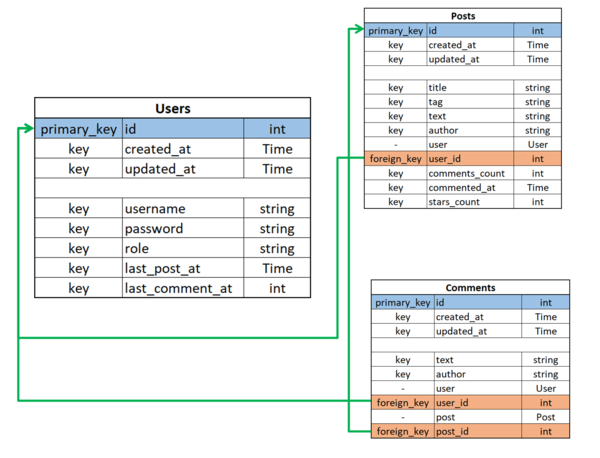

# CVWO Assignment Project

Backend for [OneNUS](https://github.com/mfjkri/OneNUS).

<br/>

# Project Status

- Currently still lacking functionality for starring of posts

Last updated: 25/12/22

<br/>

# Demo

You can find the live demo of the website that consumes this project [here](https://app.onenus.link).

<br/>

# Getting Started

## Prerequisites

1. `Go`

   Install [Go](https://go.dev/doc/install) if you have not done so yet.

<br/>

## Installation

1. Clone this repo.
   ```
   $ git clone https://github.com/mfjkri/OneNUS-Backend.git
   ```
2. Change into the repo directory.

   ```
   $ cd OneNUS-Backend
   ```

3. Copy the template `.env` file.

   ```
   $ cp .env.example .env
   ```

   Modify the following environment variables in the new `.env` file accordingly:

   ```python
   PORT=8080 # Port number that the project  will be listening to
   DB="USERNAME:PASSWORD@tcp(HOSTNAME:PORT_NUMBER)/DATABASE_NAME?charset=utf8mb4&parseTime=True&loc=Local" # Credentials to connect to database
   JWT_SECRET=JWT_SECRET # Random string that is used to generate JWT tokens
   GIN_MODE="debug" # Set to either "debug" or "release" accordingly
   ```

4. All set!

   ```
   $ go run main.go
   ```

   This command will install all dependecies automatically when first ran.

<br/>

# Table of Contents

- [CVWO Assignment Project](#cvwo-assignment-project)
- [Project Status](#project-status)
- [Demo](#demo)
- [Getting Started](#getting-started)
  - [Prerequisites](#prerequisites)
  - [Installation](#installation)
- [Table of Contents](#table-of-contents)
- [Technologies used](#technologies-used)
- [Models](#models)
  - [Models Relational diagram](#models-relational-diagram)
- [API Routes](#api-routes)
- [Controllers](#controllers)
    - [JSON vs URI](#json-vs-uri)
- [Database](#database)
- [Deployment](#deployment)
- [Reflections](#reflections)

<br/>

# Technologies used

- [GORM](https://gorm.io/) - ORM library
- [Gin](https://gin-gonic.com/) - Web framework
- [bcrypt](https://cs.opensource.google/go/x/crypto) - Cryptography library
- [JWT v4](https://github.com/golang-jwt/jwt) - JSON Web Tokens library

- Misc:
  - [godotenv](http://github.com/joho/godotenv) - Env file loader
  - [CompileDaemon](https://github.com/githubnemo/CompileDaemon) - Compile daemon for Go (development only)

<br/>

# Models

There are 3 models used in this project:

- user: See [user.go](models/user.go)
- post: See [post.go](models/post.go)
- comment: See [comment.go](models/comment.go)

Each of them also inherit from the [base model](models/base.go) which contains 3 base attributes:

```py
- ID          # PrimaryKey
- CreatedAt   # Time that entry was created
- UpdatedAt   # Time that entry was updated
```

## Models Relational diagram



<br/>

# API Routes

- `auth`:

  ```py
  auth
  ├── login       # Login of existing account
  ├── register    # Registration of new account
  └── me          # Authenticating an existing session using JWT token
  ```

- `posts`:

  ```py
  posts
  ├── get         # Fetches a list of posts based on given params
  ├── getbyid     # Fetches a single post based on ID (if any)
  ├── create      # Creates a new post
  ├── updatetext  # Updates an existing post text
  └── delete      # Deletes an existing post
  ```

- `comments`:

  ```py
  comments
  ├── get         # Fetches a list of comments from given postID
  ├── create      # Creates a new comment
  ├── updatetext  # Updates an existing comment text
  └── delete      # Deletes an existing comment
  ```

  You can find these routes defined in [`routes.go`](routes/route.go).

  <br/>

# Controllers

Each API route has a dedicated controller to handle requests made to it.

- `auth`: [auth.go](controllers/auth.go)
- `posts`: [posts.go](controllers/posts.go)
- `comments`: [comments.go](controllers/comments.go)

Each handler function has been documented in a consistent style:

```go
type ExpectedRequestTypeForHandler {
   RequestParam1  paramType `uri:"requestParam1" json:"requestParam1" binding:"required"`
   // ...
}

func Handler(c *gin.Context) {
   // ...
}
```

An example from `CreatePost` handler in [posts.go](controllers/posts.go):

```go
type CreatePostRequest struct {
  Title string `json:"title" binding:"required"`
  Tag   string `json:"tag" binding:"required"`
  Text  string `json:"text" binding:"required"`
}

func CreatePost(c *gin.Context) {
	// Check that RequestUser is authenticated
  user, found := VerifyAuth(c)
  if found == false {
    return
  }

  // Parse RequestBody
  var json CreatePostRequest
  if err := c.ShouldBindJSON(&json); err != nil {
    c.JSON(http.StatusBadRequest, gin.H{"message": err.Error()})
    return
  }

  // Request params are now accessible through:
  // json.Title, json.Tag, json.Tag

  // Rest of Handler logic
  // ...
}
```

### JSON vs URI

- All request params for `POST` requests are included in the `JSON` request body.

- Meanwhile, all request params for `GET` and `DELETE` requests are included in the URI instead.

  `ginContext.ShouldBindJSON` and `ginContext.ShouldBindUri` are used to bind and verify the request params accordingly.

<br/>

# Database

This project uses a MySQL database that is running on the same EC2 instance as the API backend (see [Deployment](#deployment)).

As such the database is not exposed to the internet except in the early phases of development for ease of testing and debugging.

A job has been scheduled to run twice daily using [cron](https://en.wikipedia.org/wiki/Cron) to backup the database (it dumps the database to a local password-protected file on the EC2 instance).

<br/>

# Deployment

This project is deployed in an [AWS EC2 instance](https://aws.amazon.com/ec2/) with a reverse-proxy using [nginx](https://www.nginx.com).

The EC2 instance is allocated an elastic IP that is routed to by [Route 53](https://aws.amazon.com/route53/).

Signed SSL certificate for the subdomain is provided by [Let's Encrypt](https://letsencrypt.org/).

<br/>

# Reflections

See [here](https://github.com/mfjkri/OneNUS#reflection) for my overall reflections after working on this project.
